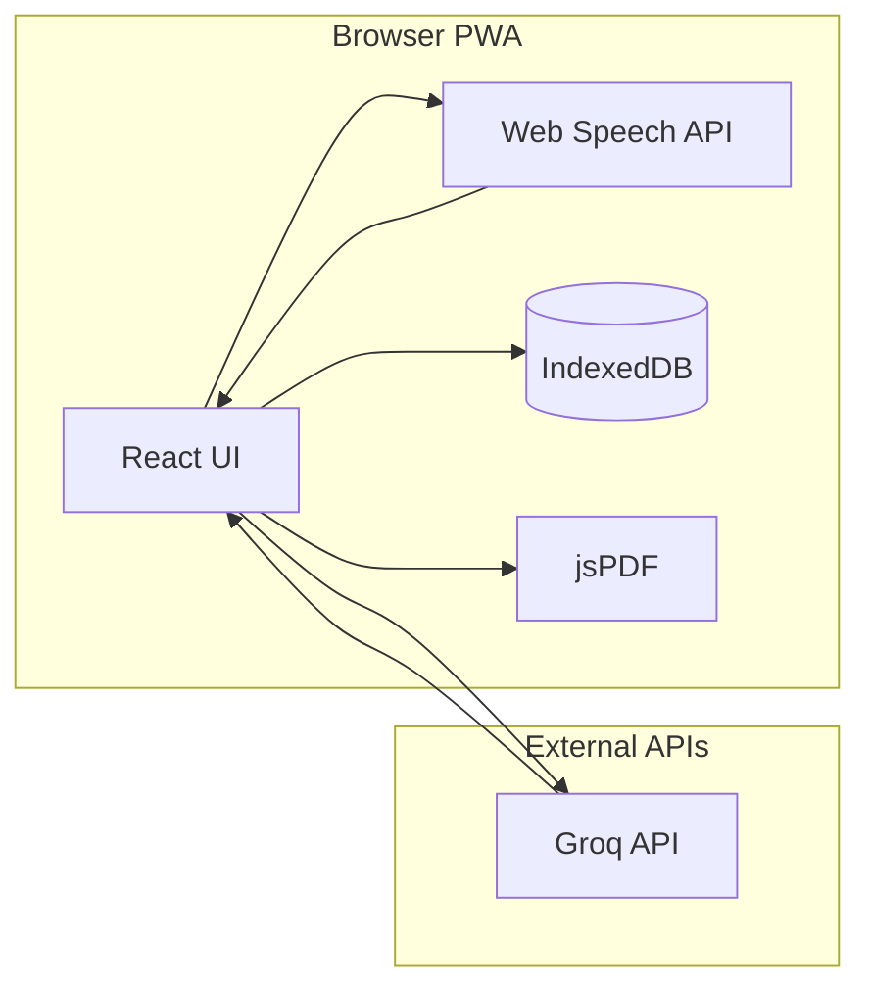

# VetTriage PWA - Build Plan

## Architecture Overview




## Tech Stack

| Layer | Technology | Rationale |

|-------|------------|-----------|

| Framework | React 18 + TypeScript | Fast dev, strong typing |

| Build | Vite | Fastest HMR, PWA plugin |

| Styling | Tailwind CSS | Rapid mobile-first UI |

| Transcription | Web Speech API | Browser-native, free, real-time |

| AI Analysis | Groq (Llama 3.3 70B) | Fast inference, free tier |

| PDF | jsPDF | Pure client-side, no server |

| Storage | IndexedDB (Dexie.js) | Offline persistence |

| PWA | vite-plugin-pwa | Service worker, manifest |---

## Phase 1: Project Scaffold

**Goal:** Bootable React app with tooling configured**Files Created:**

- `package.json` - Dependencies: react, vite, tailwindcss, typescript
- `vite.config.ts` - Vite config with PWA plugin stub
- `tailwind.config.js` - Mobile-first breakpoints
- `tsconfig.json` - Strict TypeScript
- `index.html` - Root HTML with meta viewport
- `src/main.tsx` - React entry point
- `src/App.tsx` - App shell
- `src/index.css` - Tailwind imports
- `.env.example` - `VITE_GROQ_API_KEY=your_key_here`
- `.gitignore` - node_modules, dist, .env

**Test:** `npm run dev` shows "VetTriage" heading on localhost**Commit:** `chore: initial project scaffold with Vite + React + Tailwind`---

## Phase 2: Recording UI (Mobile-First)

**Goal:** Touch-friendly UI with large record button, transcript area**Files Created:**

- `src/pages/HomePage.tsx` - Main layout
- `src/components/Header.tsx` - App title, status indicator
- `src/components/RecordButton.tsx` - Large circular button with pulse animation
- `src/components/TranscriptDisplay.tsx` - Scrollable text area
- `src/components/StatusBadge.tsx` - Recording/idle/analyzing states
- `src/hooks/useRecordingState.ts` - State machine (idle/recording/processing)

**UI Wireframe:**

```javascript
+---------------------------+
|  VetTriage      [Status]  |
+---------------------------+
|                           |
|   Live transcript area    |
|   (scrollable, grows)     |
|                           |
+---------------------------+
|                           |
|      [ RECORD ]           |
|    (large, centered)      |
|                           |
+---------------------------+
```

**Test:** Button toggles visually, UI responsive on mobile viewport**Commit:** `feat: core recording UI components`---

## Phase 3: Web Speech API Integration

**Goal:** Real-time transcription from microphone**Files Created:**

- `src/hooks/useSpeechRecognition.ts` - Web Speech API wrapper
- `startRecording()`, `stopRecording()`
- Interim results (gray text) vs final results (black text)
- Permission handling, error states
- `src/utils/browserSupport.ts` - Detect Web Speech API support

**Modified:**

- `src/components/RecordButton.tsx` - Wire to speech recognition
- `src/components/TranscriptDisplay.tsx` - Show interim/final text differently

**API:** `window.SpeechRecognition` / `window.webkitSpeechRecognition`**Browser Support:** Chrome, Edge, Safari (iOS 14.5+). Show fallback message for Firefox.**Test:** Speak into microphone, see text appear in real-time**Commit:** `feat: Web Speech API real-time transcription`---

## Phase 4: Groq AI Analysis

**Goal:** Extract structured intake data from transcript**Files Created:**

- `src/types/report.ts` - TypeScript interfaces:
  ```typescript
    interface IntakeReport {
      patient: { name, species, breed, age, weight }
      owner: { name, phone, email }
      chiefComplaint: string
      symptoms: string[]
      medicalHistory: string
      currentMedications: string[]
      assessment: string
      urgencyLevel: 1 | 2 | 3 | 4 | 5
    }
  ```

- `src/services/groq.ts` - API client with `analyzeTranscript(text): Promise<IntakeReport>`
- `src/prompts/veterinary-intake.ts` - System prompt for structured extraction
- `src/components/AnalyzeButton.tsx` - Triggers analysis
- `src/components/ReportPreview.tsx` - Displays extracted data in cards

**API:** Groq Chat Completions (`https://api.groq.com/openai/v1/chat/completions`)

**Model:** `llama-3.3-70b-versatile`**Test:** Paste sample transcript, click Analyze, see structured data displayed**Commit:** `feat: Groq AI transcript analysis`---

## Phase 5: PDF Report Generation

**Goal:** Download professional intake report as PDF**Files Created:**

- `src/services/pdfGenerator.ts` - jsPDF wrapper with `generateReport(data): void`
- `src/components/DownloadButton.tsx` - Triggers PDF download
- `src/utils/formatters.ts` - Date/time formatting utilities

**PDF Layout:**

1. Header (Clinic name placeholder, date/time, case ID)
2. Patient Information (table)
3. Owner Information (table)
4. Chief Complaint (paragraph)
5. Symptoms (bullet list)
6. Medical History
7. Current Medications
8. AI Assessment
9. Urgency Level (color-coded badge)
10. Footer ("Generated by VetTriage")

**Test:** Complete flow: Record -> Analyze -> Download PDF -> Open and verify**Commit:** `feat: PDF intake report generation`---

## Phase 6: PWA + Polish

**Goal:** Installable, offline-capable, production-ready**Files Created/Modified:**

- `vite.config.ts` - Full PWA config with workbox
- `public/manifest.json` - App name, icons, theme color, display: standalone
- `public/icons/` - icon-192.png, icon-512.png
- `src/components/ApiKeyModal.tsx` - First-run Groq key setup
- `src/components/SessionHistory.tsx` - Past recordings list
- `src/services/storage.ts` - Dexie.js IndexedDB wrapper
- `src/components/ErrorBoundary.tsx` - Graceful error handling

**Features:**

- Install prompt on mobile
- Offline app shell (API calls require network)
- Persist sessions in IndexedDB
- Loading states and error messages

**Test:**

- Lighthouse PWA audit (target 90+)
- Install on phone, test offline launch
- Full user flow on tablet

**Commit:** `feat: PWA installation and offline support`---

## Deferred to v2

| Feature | Reason |

|---------|--------|

| Backend + Postgres | Not needed for demo, add for multi-user |

| Audio file recording | Whisper fallback, add if Web Speech insufficient |

| User authentication | Single-user demo doesn't need it |

| Report editing | Keep v1 simple, auto-generated only |

| HIPAA compliance | Requires legal review, backend changes |

| Multi-language | English-only for demo |---

## API Summary

| API | Purpose | Auth |

|-----|---------|------|

| Web Speech API | Transcription | None (browser native) |

| Groq API | AI analysis | API key in .env |

| jsPDF | PDF generation | None (client-side library) |---

## Estimated Timeline

| Phase | Duration |

|-------|----------|

| Phase 1: Scaffold | 1 hour |

| Phase 2: UI | 2-3 hours |

| Phase 3: Speech | 2-3 hours |

| Phase 4: Groq | 2-3 hours |

| Phase 5: PDF | 2-3 hours |

| Phase 6: PWA | 3-4 hours |