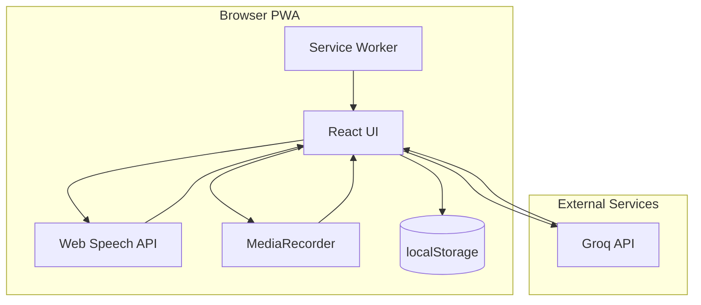
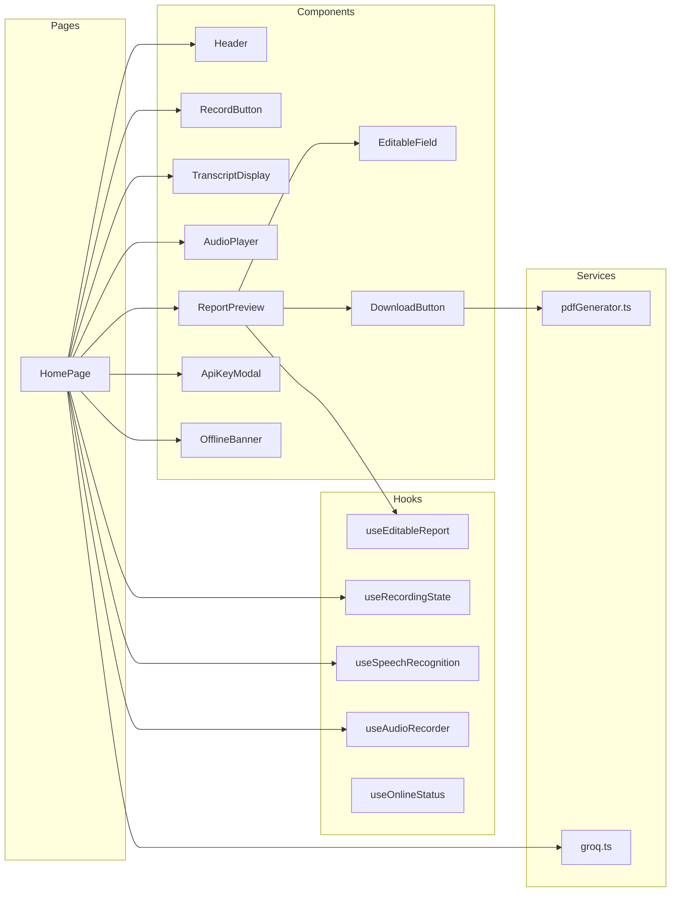
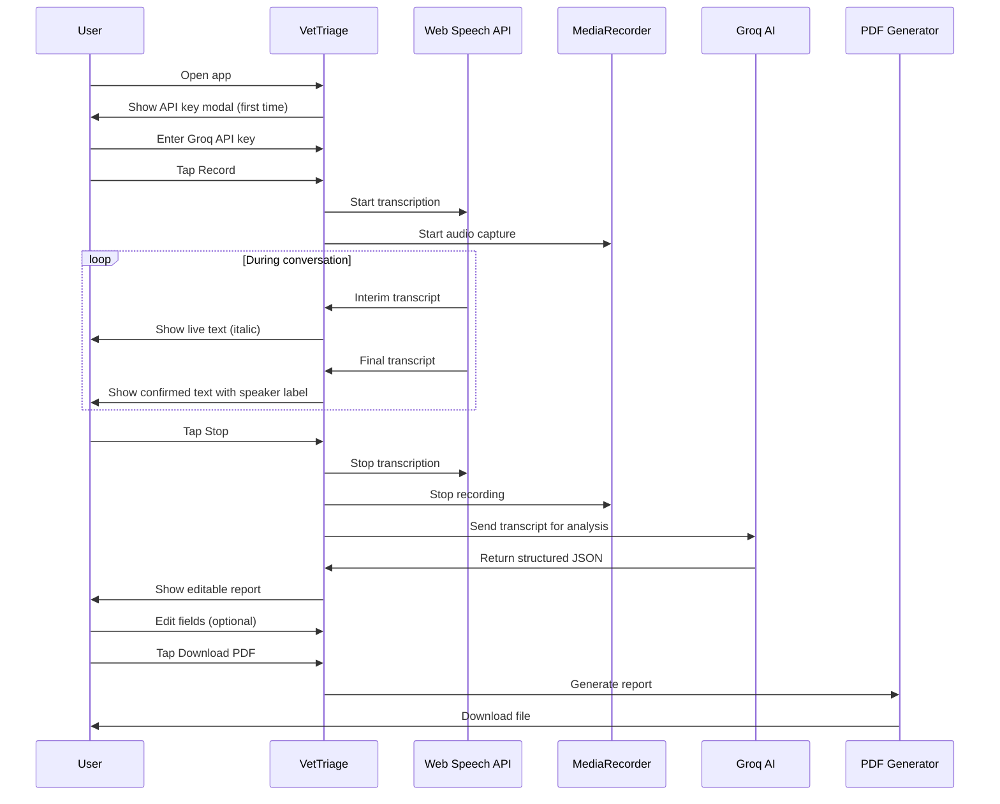

# 🐾 VetTriage

**AI-powered veterinary intake assistant** — A production-ready PWA that passively records veterinary conversations, transcribes them in real-time with speaker diarization, analyzes the transcript with AI, and generates structured intake reports downloadable as PDF.

[](https://vettriage.vercel.app)
[](LICENSE)
[](https://web.dev/progressive-web-apps/)

---

## ✨ Features

| Feature                    | Description                                                    |
| -------------------------- | -------------------------------------------------------------- |
| 🎙️ **Voice Recording**     | Real-time transcription using Web Speech API                   |
| 👥 **Speaker Diarization** | Automatically distinguishes Vet vs Owner based on speech turns |
| 🤖 **AI Analysis**         | Groq (Llama 3.3 70B) extracts structured intake data           |
| 📄 **PDF Reports**         | Professional one-page intake reports with jsPDF                |
| ✏️ **Editable Reports**    | Human-in-the-loop editing with change tracking                 |
| 🎵 **Audio Timeline**      | Click transcript segments to jump in audio playback            |
| 📱 **PWA**                 | Installable, works offline (UI cached)                         |
| 🌐 **Zero Setup**          | Just open the URL — no app store, no downloads                 |

---

## 🏗️ Architecture



### Component Architecture



---

## 🔄 User Flow



---

## 🛠️ Tech Stack

| Layer             | Technology            | Purpose                          |
| ----------------- | --------------------- | -------------------------------- |
| **Framework**     | React 18 + TypeScript | UI components with type safety   |
| **Build**         | Vite                  | Fast HMR, PWA plugin             |
| **Styling**       | Tailwind CSS          | Mobile-first utility classes     |
| **Transcription** | Web Speech API        | Browser-native voice recognition |
| **Audio**         | MediaRecorder API     | Parallel audio capture           |
| **AI**            | Groq (Llama 3.3 70B)  | Structured data extraction       |
| **PDF**           | jsPDF                 | Client-side PDF generation       |
| **PWA**           | vite-plugin-pwa       | Service worker, manifest         |

---

## 📁 Project Structure

```
VetTriage/
├── public/
│   ├── icons/
│   │   └── icon.svg           # PWA app icon
│   └── favicon.svg            # Browser favicon
├── src/
│   ├── components/
│   │   ├── ApiKeyModal.tsx    # First-run API key setup
│   │   ├── AudioPlayer.tsx    # Native audio playback controls
│   │   ├── DownloadButton.tsx # PDF download trigger
│   │   ├── EditableField.tsx  # Inline text editing
│   │   ├── EditableList.tsx   # Inline list editing
│   │   ├── Header.tsx         # App header with status
│   │   ├── OfflineBanner.tsx  # Offline warning banner
│   │   ├── RecordButton.tsx   # Main record/stop button
│   │   ├── ReportPreview.tsx  # Structured report display
│   │   ├── StatusBadge.tsx    # Recording state indicator
│   │   ├── TranscriptDisplay.tsx # Live transcript with speakers
│   │   └── UnsupportedBrowser.tsx # Browser fallback
│   ├── hooks/
│   │   ├── useAudioRecorder.ts    # MediaRecorder wrapper
│   │   ├── useEditableReport.ts   # Report editing state
│   │   ├── useOnlineStatus.ts     # Network detection
│   │   ├── useRecordingState.ts   # State machine
│   │   └── useSpeechRecognition.ts # Web Speech API wrapper
│   ├── pages/
│   │   └── HomePage.tsx       # Main application page
│   ├── prompts/
│   │   └── veterinary-intake.ts # AI system prompt
│   ├── services/
│   │   ├── groq.ts            # Groq API client
│   │   └── pdfGenerator.ts    # jsPDF report builder
│   ├── types/
│   │   ├── report.ts          # IntakeReport interface
│   │   └── transcript.ts      # Transcript segment types
│   ├── utils/
│   │   ├── browserSupport.ts  # Feature detection
│   │   └── formatters.ts      # Date/time utilities
│   ├── App.tsx                # Root component
│   ├── main.tsx               # Entry point
│   ├── index.css              # Tailwind imports
│   └── vite-env.d.ts          # TypeScript declarations
├── index.html                 # HTML template
├── vite.config.ts             # Vite + PWA config
├── tailwind.config.js         # Tailwind config
├── tsconfig.json              # TypeScript config
└── package.json               # Dependencies
```

---

## 🚀 Getting Started

### Prerequisites

- Node.js 18+
- npm or pnpm
- Groq API key ([get one free](https://console.groq.com/keys))

### Installation

```bash
# Clone the repository
git clone https://github.com/Rahul-sch/VetTriage.git
cd VetTriage

# Install dependencies
npm install

# Start development server
npm run dev
```

### Environment Setup

Create a `.env` file (optional — you can also enter the key in the app):

```env
VITE_GROQ_API_KEY=gsk_your_key_here
```

### Build for Production

```bash
npm run build
npm run preview  # Test production build locally
```

---

## 📖 Usage

### 1. First Launch

- Open the app in Chrome, Edge, or Safari
- Enter your Groq API key when prompted
- Key is stored in localStorage (never sent anywhere except Groq)

### 2. Recording

- Tap the **Record** button to start
- Speak naturally — the conversation is transcribed in real-time
- Speaker changes are detected automatically (1.5s pause = switch)
- Use **Switch Speaker** button to manually correct

### 3. Analysis

- Tap **Stop** when done
- AI analyzes the transcript and extracts:
  - Patient info (name, species, breed, age, weight)
  - Owner info
  - Chief complaint & symptoms
  - Medical history
  - Severity & urgency levels
  - Clinical assessment
  - Recommended actions

### 4. Review & Edit

- Click any field to edit
- "Edited" badge shows modified fields
- Changes are reflected in the PDF

### 5. Download

- Tap **Download PDF**
- File saved as `VetTriage_YYYY-MM-DD_petname.pdf`

### 6. Audio Playback

- After recording, audio player appears
- Click any transcript segment to jump to that moment
- Active segment is highlighted during playback

---

## 🔌 API Reference

### Groq Integration

The app uses Groq's Chat Completions API:

```
POST https://api.groq.com/openai/v1/chat/completions
```

**Model:** `llama-3.3-70b-versatile`

**Request format:**

```json
{
  "model": "llama-3.3-70b-versatile",
  "messages": [
    { "role": "system", "content": "..." },
    { "role": "user", "content": "VET: ... OWNER: ..." }
  ],
  "temperature": 0.1,
  "max_tokens": 2000
}
```

**Response:** Structured JSON matching `IntakeReport` interface.

---

## 📊 Data Structures

### IntakeReport

```typescript
interface IntakeReport {
  patient: {
    name: string;
    species: string;
    breed: string;
    age: string;
    weight: string;
    sex: string;
  };
  owner: {
    name: string;
    phone: string;
    email: string;
  };
  chiefComplaint: string;
  symptoms: string[];
  duration: string;
  severity: "mild" | "moderate" | "severe" | "critical";
  medicalHistory: string;
  currentMedications: string[];
  allergies: string[];
  vitalSigns: string;
  assessment: string;
  recommendedActions: string[];
  urgencyLevel: 1 | 2 | 3 | 4 | 5;
  notes: string;
}
```

### TranscriptSegment

```typescript
interface TranscriptSegment {
  speaker: "vet" | "owner";
  text: string;
  timestamp: number; // Absolute time
  relativeTime?: number; // Seconds from recording start
}
```

---

## 🌐 Browser Support

| Browser            | Transcription | Audio Recording | PWA Install |
| ------------------ | ------------- | --------------- | ----------- |
| Chrome             | ✅            | ✅              | ✅          |
| Edge               | ✅            | ✅              | ✅          |
| Safari (iOS 14.5+) | ✅            | ✅              | ✅          |
| Firefox            | ❌            | ✅              | ❌          |

> Firefox users see a fallback message recommending Chrome.

---

## 🔒 Privacy & Security

- **No backend** — All processing happens in the browser
- **API key stored locally** — Never transmitted except to Groq
- **Audio not uploaded** — Recorded audio stays on device
- **No analytics** — Zero tracking or telemetry
- **Offline capable** — App shell cached for offline use

---

## 📝 License

MIT License — feel free to use, modify, and distribute.

---

## 🙏 Acknowledgments

- [Groq](https://groq.com) for blazing-fast LLM inference
- [jsPDF](https://github.com/parallax/jsPDF) for client-side PDF generation
- [Vite](https://vitejs.dev) for the excellent build tooling
- [Tailwind CSS](https://tailwindcss.com) for utility-first styling

---

<p align="center">
  Built with ❤️ for veterinary professionals
</p>
