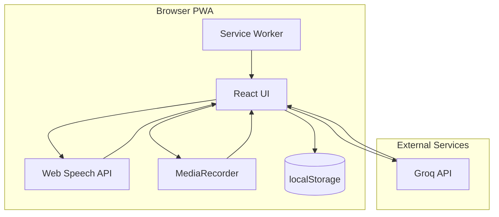
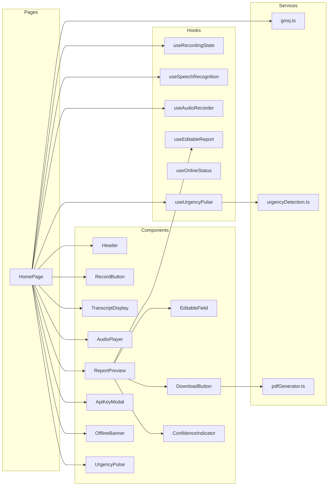
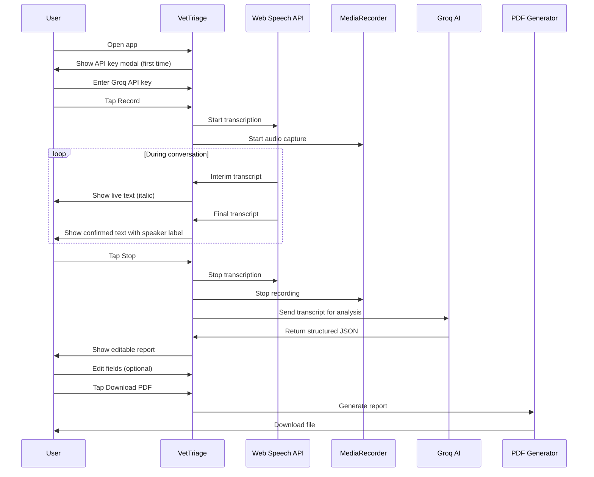

# 🐾 VetTriage

**AI-powered veterinary intake assistant** — A production-ready PWA that passively records veterinary conversations, transcribes them in real-time with speaker diarization, analyzes the transcript with AI, and generates structured intake reports downloadable as PDF.

[](https://vettriage.vercel.app)
[](LICENSE)
[](https://web.dev/progressive-web-apps/)

---

## ✨ Features

| Feature                    | Description                                                    |
| -------------------------- | -------------------------------------------------------------- |
| 🎙️ **Voice Recording**     | Real-time transcription using Web Speech API                   |
| 👥 **Speaker Diarization** | Automatically distinguishes Vet vs Owner based on speech turns |
| 🎯 **AI Confidence Scoring** | Transparent confidence levels (high/medium/low) for all fields |
| 🤖 **AI Analysis**         | Groq (Llama 3.3 70B) extracts structured intake data           |
| 📄 **PDF Reports**         | Professional one-page intake reports with jsPDF                |
| ✏️ **Editable Reports**    | Human-in-the-loop editing with change tracking                 |
| 🎵 **Audio Timeline**      | Click transcript segments to jump in audio playback            |
| 📜 **Collapsible Transcript** | Full transcript view with diagnosis/recommendation highlighting |
| 🧪 **Test Transcript**     | Always-available demo button to load mock conversation        |
| 💾 **Session Persistence** | Auto-restore transcript, audio, and report across refreshes   |
| 🔒 **Rate Limiting**       | Global rate limiter prevents API overload and 429 errors      |
| 📱 **PWA**                 | Installable, works offline (UI cached)                         |
| 🌐 **Zero Setup**          | Just open the URL — no app store, no downloads                 |

---

## 🎯 Key Features Explained

### 🎯 AI Confidence Scoring

Every field in the AI-generated report includes a confidence score (0.0-1.0) with three levels:

- **🟢 High (0.8-1.0)**: Information explicitly stated in transcript
- **🟡 Medium (0.5-0.79)**: Information implied or partially stated
- **🔴 Low (0.0-0.49)**: Information inferred or unclear

Hover over confidence indicators to see AI's reasoning notes. This transparency builds trust and helps staff identify fields that need human verification.

### 📜 Collapsible Transcript View

After recording completes, a collapsible transcript section appears below the audio player:

- **Hidden by default** — Click "Show Transcript" to expand
- **Full conversation** — Complete transcript with speaker labels (Vet/Owner)
- **Smart highlighting** — Diagnosis/assessment statements highlighted in purple
- **Recommendation highlighting** — Next steps and recommendations highlighted in green
- **Audio sync** — Click any segment to jump to that moment in audio playback
- **Active segment** — Current playback position is visually highlighted

This provides a complete view of the conversation for review and verification.

### 🧪 Test Transcript Feature

A **"🧪 Load Test Transcript (Demo)"** button is always available for testing and demos:

- **Always visible** — Available regardless of app state
- **Full reset** — Clears transcript, report, error, audio, and session
- **Mock conversation** — Loads a comprehensive test scenario covering all report fields
- **Immediate analysis** — Click "Analyze Transcript" to test the full workflow without speaking

Perfect for demos, testing, and development without needing to record actual conversations.

### 🔒 Rate Limiting & Stability

The app includes robust rate limiting to prevent API overload:

- **Global rate limiter** — Ensures minimum 2-second interval between any Groq API calls
- **Single-flight lock** — Prevents duplicate API calls (one click = one request)
- **Cooldown management** — Automatic 15-second cooldown after 429 errors
- **Defensive rendering** — Badges handle invalid data gracefully (no crashes)
- **Error recovery** — App stays stable even when Groq returns unexpected values

---

## 🏗️ Architecture



### Component Architecture



---

## 🔄 User Flow



---

## 🛠️ Tech Stack

| Layer             | Technology            | Purpose                          |
| ----------------- | --------------------- | -------------------------------- |
| **Framework**     | React 18 + TypeScript | UI components with type safety   |
| **Build**         | Vite                  | Fast HMR, PWA plugin             |
| **Styling**       | Tailwind CSS          | Mobile-first utility classes     |
| **Transcription** | Web Speech API        | Browser-native voice recognition |
| **Audio**         | MediaRecorder API     | Parallel audio capture           |
| **AI**            | Groq (Llama 3.3 70B)  | Structured data extraction       |
| **PDF**           | jsPDF                 | Client-side PDF generation       |
| **PWA**           | vite-plugin-pwa       | Service worker, manifest         |

---

## 📁 Project Structure

```
VetTriage/
├── public/
│   ├── icons/
│   │   └── icon.svg           # PWA app icon
│   └── favicon.svg            # Browser favicon
├── src/
│   ├── components/
│   │   ├── ApiKeyModal.tsx    # First-run API key setup
│   │   ├── AudioPlayer.tsx    # Native audio playback controls
│   │   ├── DownloadButton.tsx # PDF download trigger
│   │   ├── EditableField.tsx  # Inline text editing
│   │   ├── EditableList.tsx   # Inline list editing
│   │   ├── Header.tsx         # App header with status
│   │   ├── OfflineBanner.tsx  # Offline warning banner
│   │   ├── RecordButton.tsx   # Main record/stop button
│   │   ├── ReportPreview.tsx  # Structured report display
│   │   ├── StatusBadge.tsx    # Recording state indicator
│   │   ├── TranscriptDisplay.tsx # Live transcript with speakers
│   │   ├── CollapsibleTranscript.tsx # Full transcript view with highlighting
│   │   ├── UrgencyPulse.tsx   # Real-time urgency indicator (disabled by default)
│   │   ├── ConfidenceIndicator.tsx # AI confidence visual indicators
│   │   └── UnsupportedBrowser.tsx # Browser fallback
│   ├── hooks/
│   │   ├── useAudioRecorder.ts    # MediaRecorder wrapper
│   │   ├── useEditableReport.ts   # Report editing state
│   │   ├── useOnlineStatus.ts     # Network detection
│   │   ├── useRecordingState.ts   # State machine
│   │   ├── useSpeechRecognition.ts # Web Speech API wrapper
│   │   └── useUrgencyPulse.ts    # Real-time urgency analysis
│   ├── pages/
│   │   └── HomePage.tsx       # Main application page
│   ├── prompts/
│   │   ├── veterinary-intake.ts # AI system prompt
│   │   └── urgency-detection.ts # Lightweight urgency prompt
│   ├── services/
│   │   ├── groq.ts            # Groq API client with single-flight lock
│   │   ├── urgencyDetection.ts # Real-time urgency analysis
│   │   ├── rateLimiter.ts     # Global rate limiting for API calls
│   │   ├── pdfGenerator.ts    # jsPDF report builder
│   │   └── sessionStorage.ts  # IndexedDB session persistence
│   ├── types/
│   │   ├── report.ts          # IntakeReport interface
│   │   ├── transcript.ts       # Transcript segment types
│   │   └── urgency.ts          # Urgency level types
│   ├── utils/
│   │   ├── browserSupport.ts  # Feature detection
│   │   ├── formatters.ts      # Date/time utilities
│   │   ├── highlightDetection.ts # Keyword-based highlighting for transcript
│   │   └── mockTranscript.ts  # Test transcript generator for demos
│   ├── App.tsx                # Root component
│   ├── main.tsx               # Entry point
│   ├── index.css              # Tailwind imports
│   └── vite-env.d.ts          # TypeScript declarations
├── index.html                 # HTML template
├── vite.config.ts             # Vite + PWA config
├── tailwind.config.js         # Tailwind config
├── tsconfig.json              # TypeScript config
└── package.json               # Dependencies
```

---

## 🚀 Getting Started

### Prerequisites

- Node.js 18+
- npm or pnpm
- Groq API key ([get one free](https://console.groq.com/keys))

### Installation

```bash
# Clone the repository
git clone https://github.com/Rahul-sch/VetTriage.git
cd VetTriage

# Install dependencies
npm install

# Start development server
npm run dev
```

### Environment Setup

Create a `.env` file (optional — you can also enter the key in the app):

```env
VITE_GROQ_API_KEY=gsk_your_key_here
```

### Build for Production

```bash
npm run build
npm run preview  # Test production build locally
```

---

## 📖 Usage

### 1. First Launch

- Open the app in Chrome, Edge, or Safari
- Enter your Groq API key when prompted
- Key is stored in localStorage (never sent anywhere except Groq)

### 2. Recording

- Tap the **Record** button to start
- Speak naturally — the conversation is transcribed in real-time
- Speaker changes are detected automatically (1.5s pause = switch)
- Use **Switch Speaker** button to manually correct
- Interim results appear in italic, final results appear normally

### 3. Analysis

- Tap **Stop** when done
- You'll see "Analyzing Conversation..." with a loading spinner
- AI analyzes the transcript and extracts:
  - Patient info (name, species, breed, age, weight)
  - Owner info
  - **Confidence scores** for each field (hover over colored dots)
  - Chief complaint & symptoms
  - Medical history
  - Severity & urgency levels
  - Clinical assessment
  - Recommended actions

### 4. Review & Edit

- Click any field to edit
- "Edited" badge shows modified fields
- Changes are reflected in the PDF

### 5. Download

- Tap **Download PDF**
- File saved as `VetTriage_YYYY-MM-DD_petname.pdf`

### 6. Audio Playback

- After recording, audio player appears
- Click any transcript segment to jump to that moment
- Active segment is highlighted during playback

### 7. Collapsible Transcript

- After recording completes, a "Show Transcript" button appears
- Click to expand the full conversation transcript
- Diagnosis/assessment statements highlighted in purple
- Recommendations/next steps highlighted in green
- Click any segment to jump to that moment in audio

### 8. Test Transcript (Demo)

- **"🧪 Load Test Transcript (Demo)"** button is always visible
- Click to load a comprehensive mock conversation
- Perfect for testing and demos without recording
- Click "Analyze Transcript" to test the full workflow

---

## 🔌 API Reference

### Groq Integration

The app uses Groq's Chat Completions API:

```
POST https://api.groq.com/openai/v1/chat/completions
```

**Model:** `llama-3.3-70b-versatile`

**Request format:**

```json
{
  "model": "llama-3.3-70b-versatile",
  "messages": [
    { "role": "system", "content": "..." },
    { "role": "user", "content": "VET: ... OWNER: ..." }
  ],
  "temperature": 0.1,
  "max_tokens": 2000
}
```

**Response:** Structured JSON matching `IntakeReport` interface.

---

## 📊 Data Structures

### IntakeReport

```typescript
interface IntakeReport {
  patient: {
    name: ConfidentField<string>;
    species: ConfidentField<string>;
    breed: ConfidentField<string>;
    age: ConfidentField<string>;
    weight: ConfidentField<string>;
    sex: ConfidentField<string>;
  };
  owner: {
    name: ConfidentField<string>;
    phone: ConfidentField<string>;
    email: ConfidentField<string>;
  };
  chiefComplaint: ConfidentField<string>;
  symptoms: ConfidentField<string[]>;
  duration: ConfidentField<string>;
  severity: ConfidentField<"mild" | "moderate" | "severe" | "critical">;
  medicalHistory: ConfidentField<string>;
  currentMedications: ConfidentField<string[]>;
  allergies: ConfidentField<string[]>;
  vitalSigns: ConfidentField<string>;
  assessment: ConfidentField<string>;
  recommendedActions: ConfidentField<string[]>;
  urgencyLevel: ConfidentField<1 | 2 | 3 | 4 | 5>;
  notes: ConfidentField<string>;
}

interface ConfidentField<T> {
  value: T;
  confidence: {
    score: number; // 0.0 - 1.0
    level: "high" | "medium" | "low";
    note?: string; // Explanation for confidence or uncertainty
  };
}
```

### TranscriptSegment

```typescript
interface TranscriptSegment {
  speaker: "vet" | "owner";
  text: string;
  timestamp: number; // Absolute time
  relativeTime?: number; // Seconds from recording start
}
```

---

## 🌐 Browser Support

| Browser            | Transcription | Audio Recording | PWA Install |
| ------------------ | ------------- | --------------- | ----------- |
| Chrome             | ✅            | ✅              | ✅          |
| Edge               | ✅            | ✅              | ✅          |
| Safari (iOS 14.5+) | ✅            | ✅              | ✅          |
| Firefox            | ❌            | ✅              | ❌          |

> Firefox users see a fallback message recommending Chrome.

---

## ⚠️ Troubleshooting

### Rate Limit Errors

If you see "Rate limit exceeded" errors:

1. **Wait 15 seconds** — The app automatically sets a cooldown period
2. **Global rate limiter** — Ensures minimum 2-second interval between API calls
3. **Single-flight lock** — Prevents duplicate calls (one click = one request)
4. **Check your Groq usage** — Visit [Groq Console](https://console.groq.com) to monitor API usage
5. **Note:** Real-Time Urgency Pulse is currently disabled by default to prevent rate limits

### Blank Screen During Analysis

- **Fixed!** The app now shows a loading spinner during analysis
- If you still see a blank screen, check the browser console (F12) for errors
- Refresh the page — your session is automatically restored from IndexedDB

### Audio Not Playing

- Ensure you granted microphone permissions
- Check browser console for MediaRecorder errors
- Try refreshing the page — audio is restored from session storage

### Transcription Not Working

- **Chrome/Edge/Safari only** — Firefox doesn't support Web Speech API
- Grant microphone permissions when prompted
- Check browser console for permission errors
- Ensure you're using HTTPS (required for microphone access)

### Session Not Restoring

- Clear browser cache and try again
- Check IndexedDB in DevTools → Application → IndexedDB → `vettriage-session`
- Use "Reset Session" button to clear corrupted data

---

## 🔒 Privacy & Security

- **No backend** — All processing happens in the browser
- **API key stored locally** — Never transmitted except to Groq
- **Audio not uploaded** — Recorded audio stays on device
- **No analytics** — Zero tracking or telemetry
- **Offline capable** — App shell cached for offline use

---

## 📝 License

MIT License — feel free to use, modify, and distribute.

---

## 🙏 Acknowledgments

- [Groq](https://groq.com) for blazing-fast LLM inference
- [jsPDF](https://github.com/parallax/jsPDF) for client-side PDF generation
- [Vite](https://vitejs.dev) for the excellent build tooling
- [Tailwind CSS](https://tailwindcss.com) for utility-first styling

---

<p align="center">
  Built with ❤️ for veterinary professionals
</p>
